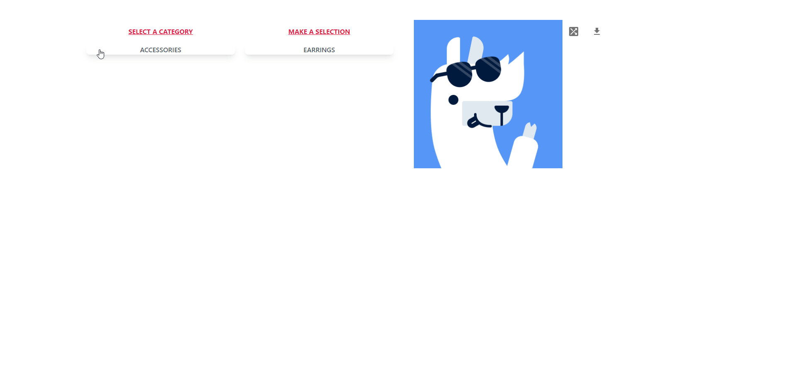

# Alpaca image generator website [LAUNCH](https://preeminent-dolphin-92d38e.netlify.app/)

This is an open source project from [DevProjects](http://www.codementor.io/projects). Feedback and questions are welcome!
Find the project requirements here: [Alpaca image generator website](https://www.codementor.io/projects/web/alpaca-image-generator-website-ce2oc0eus8)

# Select a Category

You can select a category to get options to customize your Alpaca. - Background - Ears - Nose - Neck - Hair - Mouth - Eyes - Accessories

## Tech/framework used

Built with create-react-app.

- Tailwind
- headless UI
- react hot toast

## Screenshots and demo

## Installation

Fork the project or download the zip.
If you download the zip, unzip it in a location that you will remember.
Choose your CLI and navigate to the root of the project folder.
run npm install to download depenedancy.

## License

[MIT](https://choosealicense.com/licenses/mit/)
Most open source projects use the MIT license. Feel free to choose whichever license you prefer.
